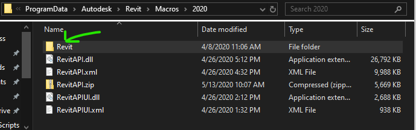
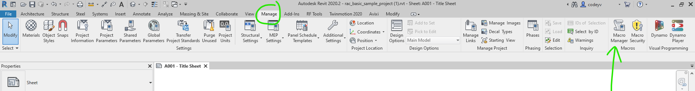
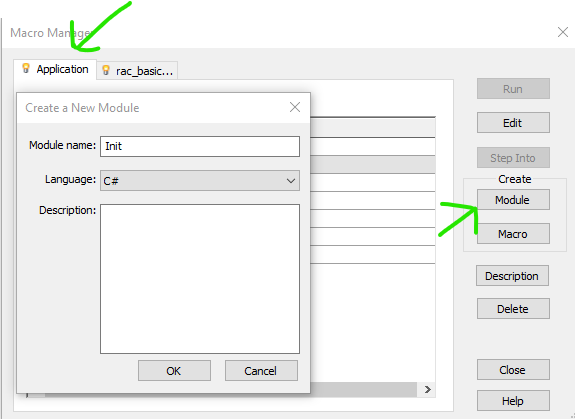

# Avixi Revit Tools

 
  

### Website

[https://www.avixi.com/](https://www.avixi.com/)

# Setup

1. **Installation**: Close Revit and run the given .exe files.

### Troubleshooting

If you are having troubles getting the Avixi Ribbon to show up, try following these steps:
- Close Revit
- Open file path [C:\ProgramData\Autodesk\Revit\Macros\2020](C:\ProgramData\Autodesk\Revit\Macros\2020)
- Delete the folder named **"Revit"**
- If the files above aren't already in the **"VERSION"** folder, you can [find them here ](RevitApi/)
- Open Revit, click on the Manage tab, click on Macro Manager 
- Click Create Module
- Give it a name and hit "OK"  
- Exit the window that pops up and exit Revit
- Run the given .exe files and reopen Revit

## Written by

Codey Van Ourkerk & Joey Smith  
<a href="http://avixi.com/">Avixi</a>  
